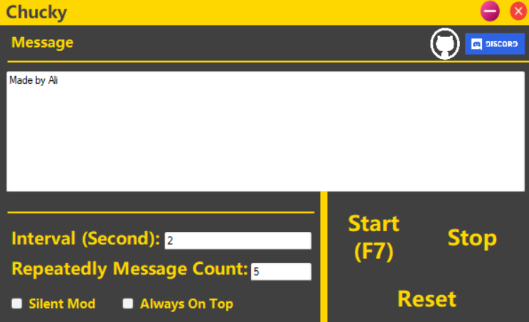

# General

This program is a spam program made with C#. Although designed for Discord, it can be used for all programs. In addition, several settings are available.

# Settings
## Interval
The first setting, Interval, takes the entered value in seconds and pauses after sending the number of messages you entered in the second settings. If you enter the value 0, it will send a continuous message.

## Repeatedly Message Count

The second setting determines the number of consecutive messages to be sent in succession. It sends the entered number of messages, then waits for the value in the first setting and this process continues.

## Silent Mod

Silent Mod is a setting that only works for discord. Thanks to this setting, you will be able to spam using the new silent feature in discord.

## Always On Top

It is NOT RECOMMENDED that you use this feature without turning it on.
Because when you check this box, the program will always stay on top. In this way, when you open the program, it will not automatically go down, and you will be able to close the program in a simple way.

## That is all

good spams :)

## Warning

None of the crimes committed with this program belong to me. This program is designed for entertainment, not crime.
